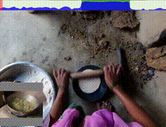

# Methods for Visual Queries 2D Localization
This repo is a codebase for our submission to the VQ2D task in Ego4D Challenge (CVPR22 and ECCV22). 
The aim of this repo is to help other researchers and challenge practitioners:

- reproduce some of our experiment results and
- leverage our pre-trained detection model for other tasks.

Currently, this codebase supports the following methods:

- [Negative Frames Matter in Egocentric Visual Query 2D Localization](https://arxiv.org/abs/2208.01949)
- [Modeling Object Proposal Sets for Egocentric Visual Query Localization](https://arxiv.org/abs/2211.10528)

## Updates
- We released our [model ckpt](https://drive.google.com/drive/folders/1Q8lAZocw3k7niWX-gQtThevdgAlCplzA?usp=share_link) and [predicted boxes](https://drive.google.com/drive/folders/1x7crW7VD3nolo-HdsiUdVwfIL6xiPSeJ?usp=share_link). See instructions in [INSTALL.md].(INSTALL.md)

- Our code to ECCV22 challenge is released!

- Our checkpoints are released! You can also find them in the Ego4D Model Zoo: https://ego4d-data.org/docs/model-zoo/.
  - [Config](https://dl.fbaipublicfiles.com/ego4d/model_zoo/vq2d/slurm_8gpus_4nodes_baseline/config.yaml) and [Checkpoint](https://dl.fbaipublicfiles.com/ego4d/model_zoo/vq2d/slurm_8gpus_4nodes_baseline/model.pth), trained with VQ2D v1.0 (used in the first challenge)
  - [Config](https://dl.fbaipublicfiles.com/ego4d/model_zoo/vq2d/slurm_8gpus_4nodes_baseline_v1.0.5/config.yaml) and [Checkpoint](https://dl.fbaipublicfiles.com/ego4d/model_zoo/vq2d/slurm_8gpus_4nodes_baseline_v1.0.5/model.pth), trained with VQ2D v1.05 (recommended)

## Introduction
We deals with the problem of localizing objects
in image and video datasets from visual exemplars. In particular, we focus on the challenging problem of egocentric visual query localization. We first identify grave implicit biases in current query-conditioned model design and
visual query datasets. Then, we directly tackle such biases at both frame and object set levels. Concretely, our
method solves these issues by expanding limited annotations and dynamically dropping object proposals during
training. Additionally, we propose a novel transformer-based module that allows for object-proposal set context to
be considered while incorporating query information. We name our module Conditioned Contextual Transformer or
CocoFormer. Our experiments show the proposed adaptations improve egocentric query detection, leading to a better
visual query localization system in both 2D and 3D configurations. Thus, we can improve frame-level detection performance from 26.28% to 31.26% in AP, which correspondingly improves the VQ2D and VQ3D localization scores
by significant margins. Our improved context-aware query object detector ranked first and second respectively in the
VQ2D and VQ3D tasks in the 2nd Ego4D challenge. 

## Visulization

[easy] frying pan             |  [hard] blue bin
:-------------------------:|:-------------------------:
 | 
<!--   |   -->

<!-- ### [easy] frying pan
<video src="visualizations/ours_easy_frying_pan.mp4" width=360></video>

### [hard] blue bin

<video src="visualizations/ours_hard_blue_bin.mp4" width=360></video> -->


## Installation

Please find installation instructions in [INSTALL.md](INSTALL.md). It includes system requirement, installation guide, and dataset preperation.

## Quick Start
Run `evaluate_vq2d_one_query.py` with our release checkpoint to quickly see the result.

```
    python evaluate_vq2d_one_query.py \
        model.config_path=$PWD/checkpoint/train_log/slurm_8gpus_4nodes_cocoformer/output/config.yaml \
        model.checkpoint_path=$PWD/checkpoint/train_log/slurm_8gpus_4nodes_cocoformer/output/model_0064999.pth \
        data.split=val logging.visualize=True logging.save_dir=$PWD/visualizations
```

## Bibtex

Our CVPR22 Challenge report is available on [arXiv](https://arxiv.org/abs/2208.01949).
```
@article{xu2022negative,
  title={Negative Frames Matter in Egocentric Visual Query 2D Localization},
  author={Xu, Mengmeng and Fu, Cheng-Yang and Li, Yanghao and Ghanem, Bernard and Perez-Rua, Juan-Manuel and Xiang, Tao},
  journal={arXiv preprint arXiv:2208.01949},
  year={2022}
}
```


Our ECCV22 Challenge report is available on [arXiv](https://arxiv.org/abs/2211.10528).

```
@article{xu2022where,
  doi = {10.48550/ARXIV.2211.10528},
  url = {https://arxiv.org/abs/2211.10528},
  author = {Xu, Mengmeng and Li, Yanghao and Fu, Cheng-Yang and Ghanem, Bernard and Xiang, Tao and Perez-Rua, Juan-Manuel},
  title = {Where is my Wallet? Modeling Object Proposal Sets for Egocentric Visual Query Localization},  
  journal={arXiv preprint arXiv:2211.10528},
  year={2022}
}

```

## License

Improved Baseline for Visual Queries 2D Localization is released under the [MIT license](LICENSE).

## Acknowledgements
This codebase relies on [detectron2](https://github.com/facebookresearch/detectron2), [Ego4d](https://github.com/EGO4D), and [episodic-memory](https://github.com/EGO4D/episodic-memory) repositories.
